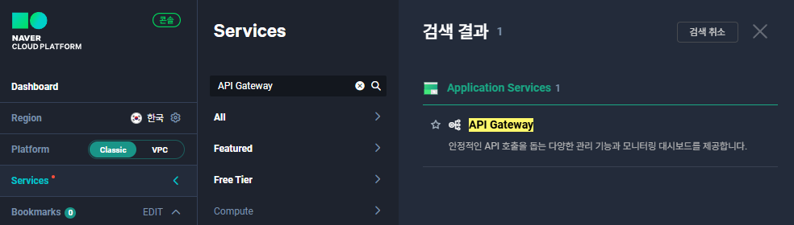
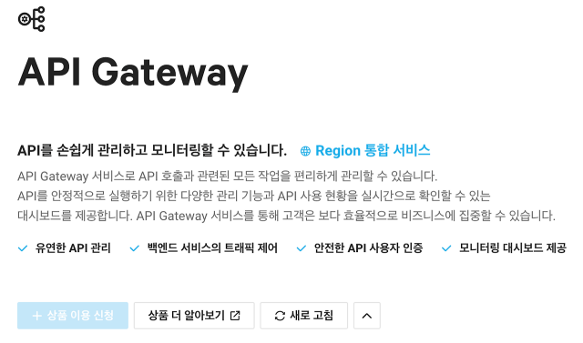
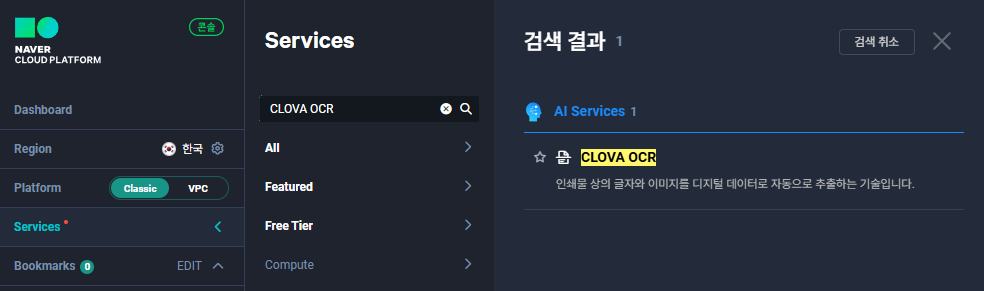
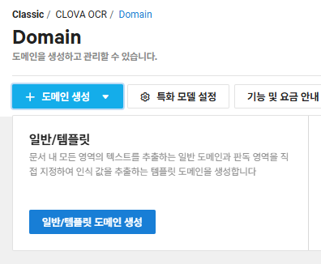
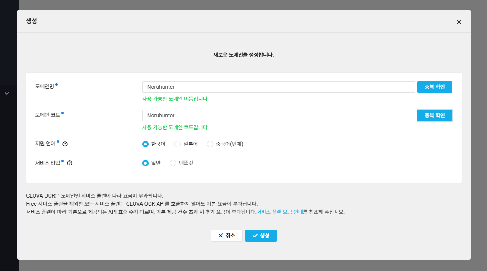
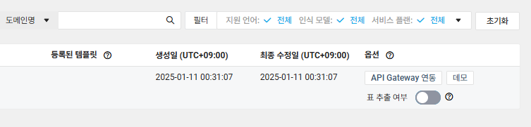
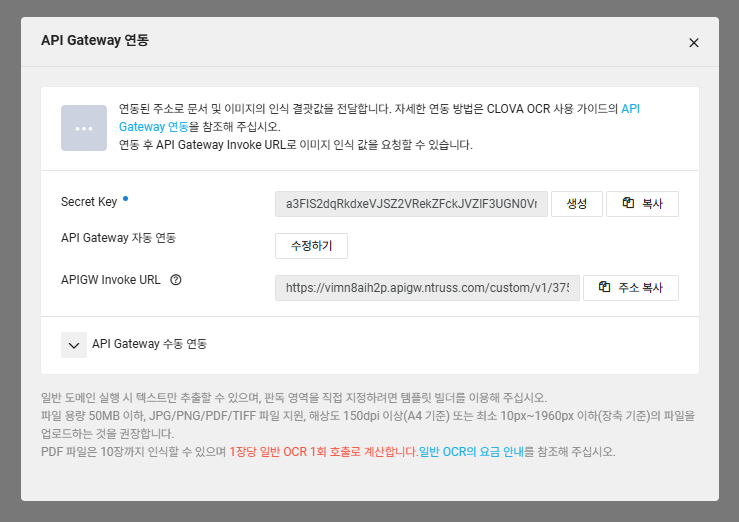
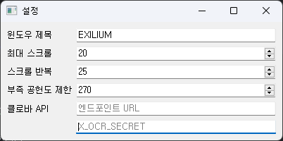

# Noruhunter

## 프로그램 소개

`Noruhunter`는 '소녀전선2:망명'에서 서클원의 정보를 관리하고, Clova OCR API를 활용하여 서클원 목록을 추출한 후 이를 엑셀 파일로 정리하는 프로그램입니다.

## Clova OCR API 연동 방법

### 1. 네이버 클라우드 가입

- [네이버 클라우드 가입](https://www.ncloud.com/) 페이지에 접속하여 계정을 생성합니다.

### 2. API Gateway 신청

1. 네이버 클라우드 콘솔에 로그인 후, **Services** 메뉴에서 **API Gateway**를 선택합니다.  
   
2. **상품 이용 신청**을 클릭합니다.  
   

### 3. Clova OCR 서비스 신청 및 사용 설정

1. **Services** 메뉴에서 **CLOVA OCR**을 선택합니다.  
   
2. **도메인 생성** 버튼을 클릭하고, **일반/템플릿 도메인 생성**을 선택합니다.  
   
3. 도메인명, 도메인 코드, 지원 언어, 서비스 타입을 설정한 후 **생성** 버튼을 클릭합니다.  
   
4. **API Gateway 연동** 버튼을 클릭하여 API를 연동합니다.  
   
5. **Secret Key**를 생성하고, API Gateway와 연동이 완료되면 자동으로 연동이 진행됩니다.  
   

### 4. API 정보 입력

1. 프로그램을 실행한 후, 메뉴 바에서 **설정** 버튼을 클릭하여 설정 창을 엽니다.
2. 설정 창에서 **APIGW Invoke URL**과 **Secret Key**를 입력합니다.
3. 설정은 자동으로 저장되므로, 창을 닫으면 설정이 완료됩니다.  
   

## 설정 방법

### 1. **설정 창 열기**
- 메뉴 바에서 **설정** 버튼을 클릭하여 설정 창을 엽니다.

### 2. **설정 항목**
- **윈도우 제목**: 프로그램 창의 제목을 설정합니다.
- **최대 스크롤**: 스크롤 반복 시 최대 값 설정.
- **스크롤 반복**: 반복되는 스크롤 횟수를 설정합니다.
- **부족 공헌도 제한**: 설정된 공헌도보다 부족한 공헌도가 클 경우, 엑셀에서 해당 항목이 강조 표시됩니다.
- **Clova API**: 발급받은 Clova OCR API Endpoint와 Secret Key를 입력합니다.

## 기능 사용법

### 서클원 목록 관리

- **서클원 추가**: 서클원의 기본 정보를 입력하고, '서클원 추가' 버튼을 클릭하여 서클원을 목록에 추가합니다.
- **서클원 삭제**: 서클원 목록에서 원하는 항목을 선택하고, '서클원 삭제' 버튼을 클릭하여 해당 서클원을 목록에서 삭제합니다.

### 인게임 목록 추출

- **인게임 목록 추출**: 
   - 게임을 실행하고 서클원 목록의 최상단을 보고 있는 상태에서, '인게임 목록 추출' 버튼을 클릭합니다.
   - 프로그램이 자동으로 서클원 목록을 추출하며, 진행 중에 스크롤을 반복하여 데이터를 수집합니다.
   - Clova OCR API를 사용하여 자동으로 목록을 추출하고, 추출된 데이터는 엑셀 파일로 정리됩니다.
   - 서클원 목록에 없는 닉네임은 **노란색**으로 강조 표시됩니다.

### 엑셀 파일 강조 규칙

- **부족 공헌도 강조**: 설정한 **부족 공헌도 제한**을 초과하는 공헌도 부족 항목은 **노란색**으로 강조됩니다.
- **서클원 목록 미포함 강조**: 프로그램에 추가한 서클원 목록에 닉네임이 존재하지 않는 경우, 해당 항목은 **붉은색**으로 강조됩니다.
